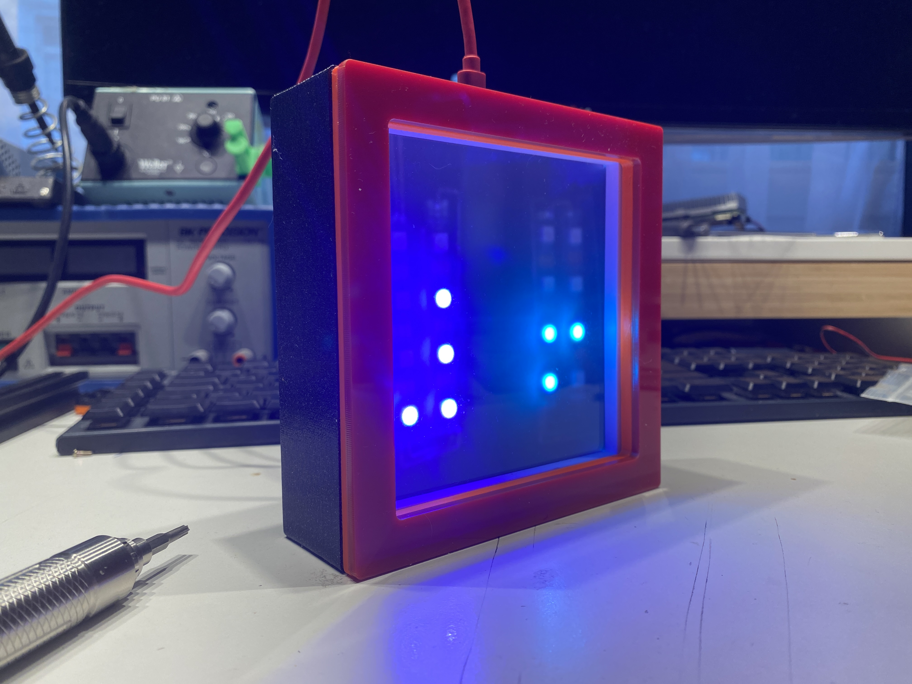
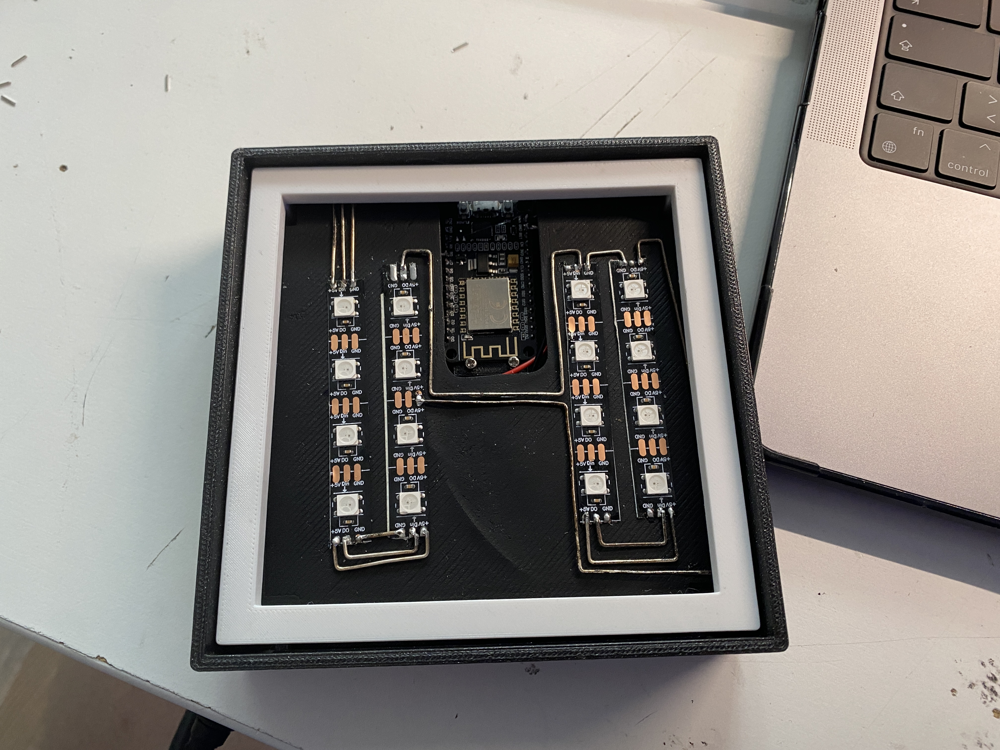

# BinaryClock

A new year, a new binary clock. Here the old binary clock project was given a facelift with a completely new modular case design. 
The software has the same features as the LixieClock or WordClock project.

## ELECTRONICS

### PARTS

* 4x 4 WS2812 LEDS
* 1x ESP32 or ESP8266
* 1.5mm SILVER-WIRE
* MICRO USB breakout board

### ASSEMBLY

